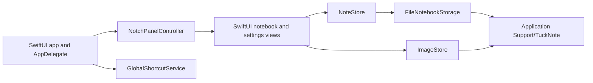

# TuckNote

TuckNote is a lightweight macOS scratchpad that tucks beneath the display notch. It keeps a small notebook close at hand without adding a Dock icon or a conventional app window.

## Features

- Compact and expanded notch-mounted note views
- Up to five Markdown pages with rendered headings, links, lists, and code
- Inline PNG attachments
- Configurable click or hover presentation
- Global keyboard shortcut support
- Automatic local saves and damaged-notebook recovery
- Menu bar controls for showing, hiding, and quitting

## Local data

TuckNote stores notes and images only on your Mac in `~/Library/Application Support/TuckNote/`. The notebook is saved as `notebook.json`; attached images live in the `Images` directory. TuckNote does not provide sync or send notebook content to a service.

## Requirements

- macOS 14 Sonoma or later
- Swift 6 toolchain and Xcode Command Line Tools for source builds

## Build and test

```sh
swift build
swift test
```

Create an unsigned release app and ZIP archive:

```sh
./Scripts/package-app.sh
```

The artifacts are written to `dist/TuckNote.app` and `dist/TuckNote-macOS.zip`.

## Architecture



The SwiftUI views are hosted in an AppKit panel managed by `NotchPanelController`. `NoteStore` owns notebook state and debounced persistence, while `FileNotebookStorage` and `ImageStore` keep JSON and PNG data on disk. `GlobalShortcutService` bridges the KeyboardShortcuts dependency into the app lifecycle.

## Opening an unsigned build

Release artifacts are not signed or notarized. On first launch, Control-click or right-click `TuckNote.app` in Finder, choose **Open**, then confirm **Open**. macOS remembers that choice for later launches. Only bypass this warning for a build you trust.

## Credits

TuckNote uses [MarkdownEngine](https://github.com/nodes-app/swift-markdown-engine) under the Apache License 2.0 and [KeyboardShortcuts](https://github.com/sindresorhus/KeyboardShortcuts) under the MIT License. Their license texts are reproduced in `THIRD_PARTY_NOTICES.md` and included in packaged builds.

## License

TuckNote is available under the [MIT License](LICENSE). Copyright (c) 2026 lyunify.
