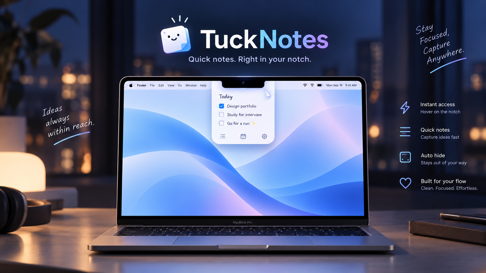

# TuckNotes



Task-first notes, tucked into your MacBook notch.

TuckNotes is a small local Markdown notebook for quick tasks, links, ideas, and screenshots. It stays near the top of your screen, opens from the notch area when you need it, and gets out of the way when you do not.

No account. No cloud sync. Your notes stay on your Mac.

Try the [TuckNotes product homepage and live demo](https://lyunify.github.io/TuckNote/). The static site source lives in [`docs/`](docs/).

## Why TuckNotes

- Lives in the notch area instead of another window, tab, or menu bar popover.
- Opens quickly for short notes and task capture, then collapses back into a compact panel.
- Treats tasks as a first-class workflow with checkbox polish, progress, and `Cmd+Enter` toggling.
- Supports Markdown without turning the app into a heavy document editor.
- Keeps notebook data local by default.

## Features

- Notch-mounted compact and expanded panels
- Hover or click presentation modes
- Pin mode for keeping the note panel open
- Resizable centered panel
- Light and dark themes with a quick sun/moon toggle
- Local Markdown pages with no fixed page limit
- Headings, links, lists, task lists, and fenced code blocks
- Task progress such as `2/5 done`
- Hide completed tasks without changing the underlying Markdown
- Paste or drag inline PNG attachments
- Global keyboard shortcut support
- Automatic local saves and damaged-notebook recovery

## Using TuckNotes

Open TuckNotes by hovering or clicking the notch zone, or by using the global keyboard shortcut. Pin it when you want it to stay visible while switching apps.

Use the editor toolbar for Markdown formatting, list creation, task insertion, and code blocks. Put the cursor on a task line and press `Cmd+Enter` to toggle completion. The eye button hides completed tasks from view while preserving the original Markdown.

Use the sun/moon button next to the pin control to switch between light and dark themes.

## Privacy And Local Data

TuckNotes stores notes and images only on your Mac in:

```text
~/Library/Application Support/TuckNote/
```

The notebook is saved as `notebook.json`; attached images live in the `Images` directory. TuckNotes does not sync content, create an account, or send notebook data to a service.

## How It Works

TuckNotes is a SwiftUI app hosted inside an AppKit panel. `NotchPanelController` owns the floating panel, hover behavior, pinning, resizing, and screen positioning. `NotchGeometry` keeps the expanded panel aligned with the notch and away from unsafe screen areas.

`NotebookView` renders the main note shell, page controls, theme toggle, and settings entry point. `MarkdownEditorView` wraps the native Markdown editor experience, including toolbar actions, task checkbox rendering, cursor protection, code block styling, and task progress.

Notebook state is managed by `NoteStore`. `FileNotebookStorage` writes the notebook JSON to Application Support, while `ImageStore` manages pasted or dropped PNG attachments. `GlobalShortcutService` bridges the app lifecycle with the global shortcut dependency.

## Requirements

- macOS 14 Sonoma or later
- Swift 6 toolchain and Xcode Command Line Tools for source builds

## Development

```sh
swift build
swift test
```

Create an unsigned release app and ZIP archive with:

```sh
./Scripts/package-app.sh
```

The artifacts are written to `dist/TuckNotes.app` and `dist/TuckNotes-macOS.zip`.

## Opening Unsigned Builds

Release artifacts are not signed or notarized. On first launch, Control-click or right-click `TuckNotes.app` in Finder, choose **Open**, then confirm **Open**. macOS remembers that choice for later launches. Only bypass this warning for a build you trust.

## Credits

TuckNotes uses [MarkdownEngine](https://github.com/nodes-app/swift-markdown-engine) under the Apache License 2.0 and [KeyboardShortcuts](https://github.com/sindresorhus/KeyboardShortcuts) under the MIT License. Their license texts are reproduced in `THIRD_PARTY_NOTICES.md` and included in packaged builds.

## License

TuckNotes is available under the [MIT License](LICENSE). Copyright (c) 2026 lyunify.
